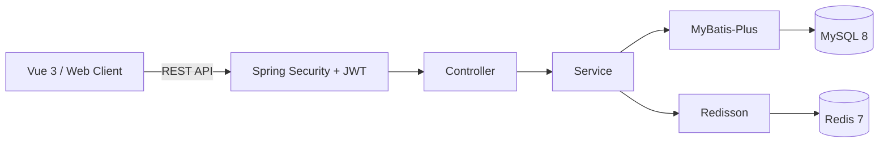

# HotForge · 热练

<div align="center">

**面向健身行业的在线预约与健康管理平台**

从课程发布、审核与排期，到高并发抢课、体测追踪和会员服务，构建完整的数字化健身业务闭环。


</div>

---

## 项目简介

HotForge（热练）是一个采用前后端分离架构的健身预约与健康管理平台，围绕用户、教练、课程、排期、抢课、体测和会员服务展开。

系统面向四类角色设计：

- **普通用户（USER）**：浏览课程、参与抢课、管理预约与体测记录
- **VIP 用户（VIP）**：访问会员专享课程及优先预约能力
- **教练（TRAINER）**：发布课程、管理排期并维护学员服务
- **管理员（ADMIN）**：审核教练、课程与排期，维护平台运行秩序

项目当前以学习和工程实践为目标，重点探索 Spring Boot 后端分层设计、JWT 无状态认证、Redis 原子操作以及高并发预约场景下的数据一致性。

## 核心能力

| 业务领域 | 能力说明 |
| --- | --- |
| 用户体系 | 手机号注册登录、BCrypt 密码加密、JWT 身份认证、角色权限控制 |
| 课程管理 | 官方课程、教练课程、直播课程的发布、审核与上下架 |
| 排期管理 | 直播课程时段、容量、状态及直播入口管理 |
| 高并发抢课 | Redisson 用户级锁 + Redis Lua 原子扣减 + MySQL 唯一约束 |
| 预约管理 | 重复预约拦截、限时取消、库存回补和状态流转 |
| 体测追踪 | 体重、体脂、围度、睡眠、心率及步数记录 |
| VIP 服务 | 会员订单、有效期管理、专享课程和优先预约窗口 |
| 平台治理 | 教练认证、内容审核、操作日志与统一异常响应 |

## 技术架构



### 后端技术栈

- Java 17
- Spring Boot 4.1.0
- Spring Security + JWT
- MyBatis-Plus 3.5.5
- MySQL 8.0
- Redis 7.x + Redisson
- Maven

### 前端规划

- Vue 3
- Vite
- Element Plus
- Pinia
- Vue Router
- Axios

## 高并发抢课设计

HotForge 将并发治理集中在直播课程抢课链路中：

```text
用户发起抢课
    │
    ├─ Redisson 锁：限制同一用户对同一场次的并发请求
    │
    ├─ Redis Lua：原子完成名单判重、库存校验与库存扣减
    │
    ├─ MySQL：同步写入预约记录，唯一索引提供最终判重保障
    │
    └─ 写入失败：执行反向 Lua 脚本，回补名单与库存
```

该方案让约满和重复请求尽可能在 Redis 层快速结束，减少无效数据库写入，同时通过唯一约束、失败回滚与定时对账控制数据一致性风险。

## 数据模型

项目当前包含 8 张核心业务表：

| 数据表 | 用途 |
| --- | --- |
| `user` | 用户、角色、状态及 VIP 信息 |
| `trainer_application` | 教练认证申请与审核记录 |
| `course` | 课程内容及审核状态 |
| `course_session` | 直播课程排期与容量 |
| `booking` | 用户抢课及预约状态 |
| `fitness_record` | 用户体测与健康数据 |
| `vip_order` | VIP 购买记录与有效期 |
| `operation_log` | 平台关键操作审计日志 |

完整数据库定义位于项目根目录的 [`.sql`](./.sql)。

## 项目结构

```text
HotForge/
├─ src/main/java/org/example/hotforge/
│  ├─ common/         # 统一响应、状态码与异常体系
│  ├─ config/         # Security、JWT、Redis 等配置
│  ├─ controller/     # REST API 接口层
│  ├─ dto/            # 请求与响应数据模型
│  ├─ entity/         # MyBatis-Plus 数据实体
│  ├─ mapper/         # 数据访问层
│  ├─ service/        # 核心业务逻辑
│  └─ util/           # 通用工具类
├─ src/main/resources/
│  └─ application.yml
├─ src/test/          # 自动化测试
├─ .sql               # 数据库结构与初始化数据
└─ pom.xml
```

## 当前进度

### 已完成

- [x] Spring Boot 项目骨架与基础依赖
- [x] 8 张核心业务表及初始化 SQL
- [x] Entity 与 Mapper 数据访问层
- [x] 统一响应结果与业务状态码
- [x] 全局异常处理体系
- [x] JWT 生成、解析与认证过滤器
- [x] Spring Security 无状态认证配置
- [x] 用户注册、登录及个人信息接口

### 正在推进

- [ ] 课程发布、查询与审核
- [ ] 直播课程排期管理
- [ ] Redis 库存预热与高并发抢课
- [ ] 预约取消、库存回补与定时对账
- [ ] 体测记录管理
- [ ] 角色级接口权限控制

### 后续规划

- [ ] Vue 3 前端基础框架与用户端页面
- [ ] 教练工作台与管理后台
- [ ] 前后端联调及业务测试
- [ ] Docker Compose 环境编排
- [ ] 生产部署与性能压测

## 本地启动

### 环境要求

- JDK 17
- Maven 3.9+
- MySQL 8.0+
- Redis 7.x

### 初始化步骤

1. 克隆项目并进入目录。
2. 创建名为 `hotforge` 的 MySQL 数据库。
3. 执行根目录 `.sql` 初始化表结构与基础数据。
4. 启动 MySQL 与 Redis。
5. 设置本地环境变量，敏感信息不要写入仓库：

```powershell
$env:DB_USERNAME="root"
$env:DB_PASSWORD="<你的本地数据库密码>"
$env:JWT_SECRET="<使用 openssl rand -base64 32 生成的密钥>"
```

6. 运行项目：

```bash
mvn spring-boot:run
```

<div align="center">

**Forge Your Strength, Feel the Heat.**

持续打磨中 · HotForge

</div>
