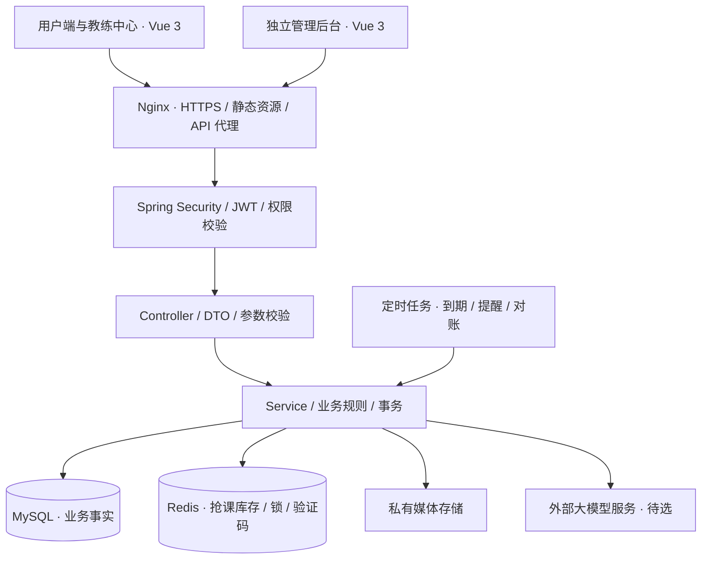
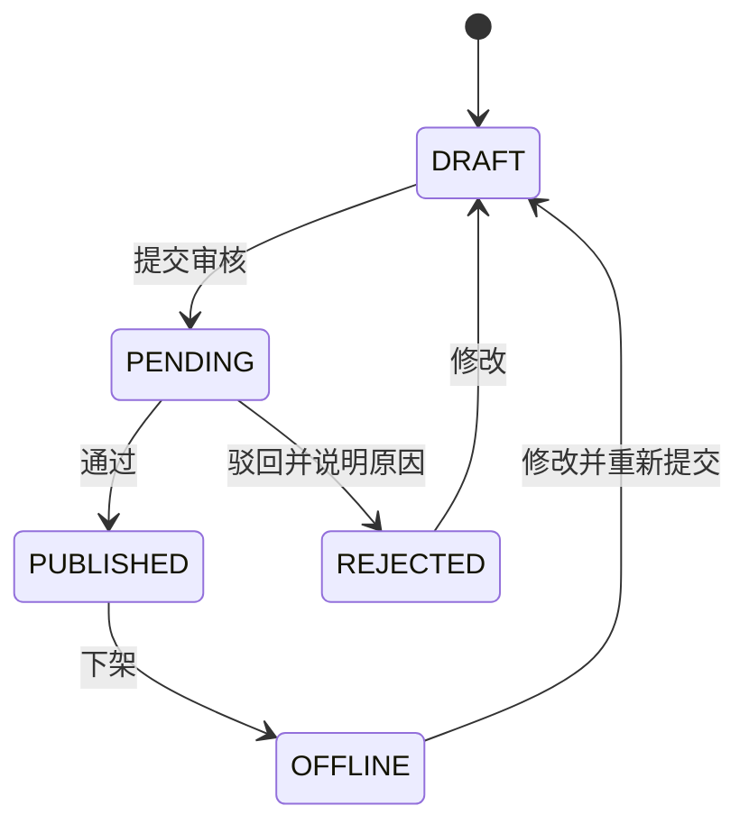
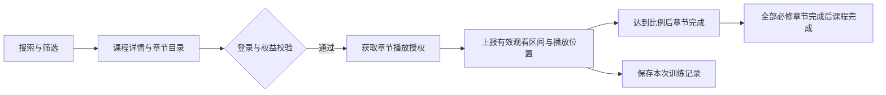
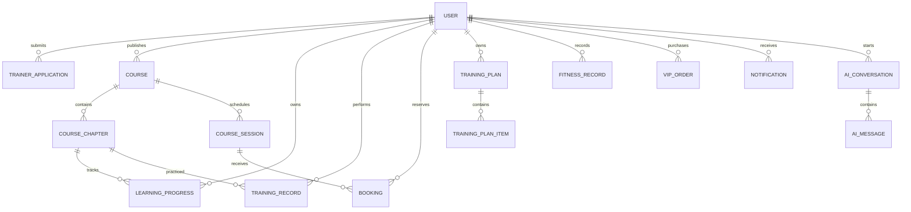

# HotForge（热练）项目设计文档

> 版本：V1.0 设计基线草案
> 日期：2026-09-19
> 依据：项目 `CLAUDE.md`、当前代码与数据库结构，以及本次 28 项需求确认。
> 用途：学习实践、求职作品、后续开发与验收依据。

本文描述目标系统，不代表全部功能已经实现。标为“已确认”的内容来自需求访谈；实现方案属于本次设计建议；标为“待确认”的参数与外部服务不得直接视为已批准的业务规则。本文不包含开源使用许可声明。

## 目录

1. [项目定位与建设范围](#1-项目定位与建设范围)
2. [需求确认与原设计调整](#2-需求确认与原设计调整)
3. [身份、权限与业务边界](#3-身份权限与业务边界)
4. [整体架构](#4-整体架构)
5. [技术选型](#5-技术选型)
6. [核心业务流程](#6-核心业务流程)
7. [高并发抢课与一致性设计](#7-高并发抢课与一致性设计)
8. [数据模型](#8-数据模型)
9. [接口设计](#9-接口设计)
10. [前端页面与交互设计](#10-前端页面与交互设计)
11. [部署与文件存储](#11-部署与文件存储)
12. [安全与运行维护](#12-安全与运行维护)
13. [测试与性能验收](#13-测试与性能验收)
14. [开发进度与实施计划](#14-开发进度与实施计划)
15. [待确认事项与参考资料](#15-待确认事项与参考资料)

## 1. 项目定位与建设范围

### 1.1 项目简介

HotForge（热练）是一站式在线健身课程学习与健康管理平台，围绕“发现课程、按章节跟练、参与直播、安排训练、记录变化”构建用户体验，并向认证教练提供课程发布和教学管理能力。

用户可以随时学习录播课程，也可以直接观看开放直播，或通过抢课预约限额小班课。本文中的“抢课”是竞争有限的预约名额，不涉及课程单独收费；第一版付费功能仅包括模拟购买 VIP。

### 1.2 建设目标

- 产品目标：完成从课程发现到训练记录、体测趋势的使用闭环。
- 学习目标：掌握后端分层、身份鉴权、事务、Redis 原子操作、前后端协作和测试部署。
- 求职展示目标：以可演示的完整业务、可解释的设计取舍和真实压测结果体现工程能力。
- 性能目标：支持 2000 并发用户，抢课接口达到 500 QPS；验收条件见第 13 节。

### 1.3 目标用户

| 用户群体 | 主要需求 | 主要入口 |
| --- | --- | --- |
| 居家健身用户 | 找到合适课程、持续跟练、查看体测变化 | 课程首页、录播播放器、体测 |
| 健身爱好者 | 多章节学习、训练计划、持续记录 | 课程、训练计划、训练记录 |
| 健身房会员 | 线上补充学习、观看教练直播、预约小班课 | 课程、直播、小班课预约 |
| 认证教练 | 发布自己的课程、安排直播、管理教学内容 | 教练中心 |
| 平台管理员 | 教练认证审核、课程审核、平台内容管理 | 独立管理后台 |

健身房会员属于服务人群，不代表首版支持门店、线下签到或线下课程预约。

### 1.4 第一版范围

| 模块 | 已确认范围 |
| --- | --- |
| 账号 | 手机号与密码登录，模拟验证码支持注册验证和找回密码 |
| 身份 | 普通用户能力为基础；教练资格、VIP 权益分别管理 |
| 录播 | 官方录播、教练录播，多章节视频、倍速、全屏、续看 |
| 课程发现 | 名称搜索，训练部位、难度、器械、时长筛选，收藏、人工精选 |
| 学习记录 | 按实际观看比例完成章节，全部章节完成后完成课程 |
| 训练计划 | 平台与教练发布计划，用户自行组合课程创建私人计划 |
| 直播 | 开放直播与限额小班课；首版使用明确标注的模拟直播间 |
| 抢课 | 防重复、防时间冲突、每日预约上限、取消后重抢 |
| 教练 | 用户申请认证，通过后发布课程；课程审核后自行排期 |
| VIP | 专享录播、专享直播；模拟订单、续费、有效期管理 |
| 体测 | 手动录入体重、体脂、围度，查看变化曲线 |
| AI | 健身问答助手 |
| 通知 | 站内消息、未读状态、消息详情 |
| 前端 | 电脑网页优先；用户端与教练中心共用项目，管理后台独立 |

### 1.5 暂不纳入第一版

手机适配、小程序、原生 App、真实直播、真实支付、单课收费、教练收入结算、VIP 优先抢课、候补、缺席处罚、课程评分评论、算法推荐、摄像头动作评分、AI 生成训练计划、穿戴设备同步、短信及邮件通知均不作为首版验收项。

RocketMQ、微服务与多实例负载均衡保留为后续研究方向。Docker Compose 和 Nginx 静态站点托管、反向代理可用于首版部署，不意味着首版必须分布式部署。

## 2. 需求确认与原设计调整

### 2.1 28 项访谈结论

| 题号 | 已确认结论 |
| --- | --- |
| 1 | 学习实践与求职作品并重 |
| 2 | 面向居家健身用户、健身爱好者、健身房会员，认证教练可发布课程 |
| 3 | 综合健身：录播、直播抢课、训练记录、体测、教练管理 |
| 4 | 电脑网页优先，手机适配后期实施 |
| 5 | 手机号＋密码，模拟验证码支持注册与找回密码 |
| 6 | 一个账号可兼具用户能力、教练资格、VIP 权益 |
| 7 | 官方录播、教练录播、教练直播；只做线上课程 |
| 8 | 一门录播课程包含多个章节视频 |
| 9 | 搜索、筛选、收藏、人工精选；不含评论与个性化推荐 |
| 10 | 视频播放、倍速、全屏、章节切换、进度续看 |
| 11 | 按实际观看比例完成章节，全部章节完成后完成课程 |
| 12 | 平台与教练发布计划，用户可自行创建计划 |
| 13 | 首版模拟直播间，真实直播后期接入 |
| 14 | 开放直播直接观看，限额小班课需要抢课 |
| 15 | 禁止预约时间冲突，允许取消后重抢，设置每日预约上限 |
| 16 | 用户提前 2 小时、教练提前 24 小时取消；紧急停课由管理员处理，无缺席处罚 |
| 17 | 审核教练认证和课程发布，直播排期无需逐场审核 |
| 18 | VIP 专享录播和直播，不做优先抢课 |
| 19 | 模拟 VIP 购买、订单、续费与有效期管理 |
| 20 | 手动录入体重、体脂、围度并展示趋势 |
| 21 | 首版实现健身问答助手 |
| 22 | 只做站内消息，支持未读标记与详情 |
| 23 | 课程探索型首页，突出搜索、分类、精选和教练课程 |
| 24 | 白色＋蓝色，简洁清晰，以内容和功能为主 |
| 25 | 用户与教练共用前端，管理后台独立 |
| 26 | 保留现有技术组合，允许调整兼容版本，前端使用 JavaScript |
| 27 | 单体分层＋Redis/Lua/Redisson＋同步写 MySQL；2000 并发用户、500 QPS 为验收目标 |
| 28 | 完整设计，包含部署、文件存储、测试、性能验证与运维 |

### 2.2 与原 CLAUDE.md 的主要差异

| 原设计 | 本次目标设计 | 原因 |
| --- | --- | --- |
| USER/VIP/TRAINER/ADMIN 单一角色 | 账号基础角色、教练资格、会员权益分离 | 教练也可学习课程与购买会员 |
| 课程直接保存一个 video_url | 课程下增加章节，每章绑定视频 | 支持多章节学习 |
| 所有 LIVE 课程均需抢课 | 区分 OPEN 开放直播与 LIMITED 小班课 | 开放观看与限额预约共存 |
| 排期需审核 | 通过审核的直播课程可自行排期 | 减少重复审核 |
| VIP 优先窗口 | 仅 VIP 专享，不提前抢课 | 按访谈结果收缩权益 |
| 取消后仍受唯一键约束、无重抢方案 | 同一预约行取消后重新激活，并标记预约批次 | 保留唯一约束同时支持重抢 |
| 同一人同一场次锁 | 用户级锁＋数据库并发约束 | 跨场次冲突和日上限也需保护 |
| Redis 为准与 MySQL 为准表述混用 | MySQL 为业务事实，Redis 为高并发准入库存 | 明确恢复与对账方向 |
| 5 分钟同步与 5 秒一致性混用 | 正常事务同步落库，补偿与对账分别设定目标 | 不把扫描周期当作一致性时延 |
| 凌晨统一标记直播结束 | 按实时场次时间检查，定时任务补齐状态 | 避免结束课程持续显示可上课 |
| 仅 8 张表 | 保留并调整 8 张表，按新增功能补表 | 覆盖学习、计划、消息和 AI |

本次只产出设计文档，具体代码及根目录 `.sql` 的变更在后续模块实施时完成。

## 3. 身份、权限与业务边界

### 3.1 身份模型

- 账号基础角色建议保留 `USER / ADMIN`，用于区分平台管理权限。
- 教练资格使用独立状态 `NONE / PENDING / APPROVED / REJECTED / SUSPENDED`；暂停状态为管理方案建议。
- VIP 使用 `vip_expire_time` 判断是否有效，不占用基础角色字段。
- 用户可同时具有“普通账号＋认证教练＋有效 VIP”。
- 教练申请记录保存审核历史，用户表保存当前资格；审核通过时在同一事务更新。
- JWT 中的角色不能代替最新的账号状态、教练资格和会员有效期检查。

### 3.2 权限矩阵

以下为实施建议；游客浏览与管理员审核预览等交互策略可在实现前调整。

| 操作 | 游客 | 登录用户 | 有效 VIP | 认证教练 | 管理员 |
| --- | --- | --- | --- | --- | --- |
| 浏览已发布课程简介、目录 | 是 | 是 | 是 | 是 | 是 |
| 学习普通录播 | 否 | 是 | 是 | 是 | 业务学习按普通规则 |
| 学习 VIP 录播 | 否 | 否 | 是 | 自己有 VIP 时可学；自有课程可管理预览 | 审核预览 |
| 进入普通开放直播 | 否 | 是 | 是 | 是 | 管理预览 |
| 进入 VIP 直播 | 否 | 否 | 是 | 有 VIP 或为该场主持教练 | 管理预览 |
| 抢普通小班课 | 否 | 是 | 是 | 可作为学员参与他人课程 | 不通过管理权限绕过名额 |
| 抢 VIP 小班课 | 否 | 否 | 是 | 具有有效 VIP 时 | 同上 |
| 管理个人计划、体测、消息 | 否 | 本人 | 本人 | 本人 | 不默认访问用户私人内容 |
| 发布教练课程、排期 | 否 | 否 | 否 | 本人课程 | 平台管理 |
| 审核教练、课程及精选运营 | 否 | 否 | 否 | 否 | 是 |

认证、资源归属和会员权益由服务端逐层校验。前端隐藏菜单仅用于改善体验。

## 4. 整体架构

### 4.1 逻辑架构

采用一个 Spring Boot 后端应用，按业务模块划分职责，统一访问 MySQL 和 Redis。两个 Vue 前端共享同一套后端 API。



### 4.2 后端模块

| 模块 | 职责 |
| --- | --- |
| 账号与身份 | 注册登录、密码找回、账号状态、教练资格 |
| 课程与内容 | 课程、章节、分类标签、审核、收藏、人工精选 |
| 学习与训练 | 播放授权、学习进度、训练记录、训练计划 |
| 直播与预约 | 开放直播、小班排期、抢课、取消、模拟课堂 |
| 会员 | 模拟购买、订单、续费、实时权益判断 |
| 体测 | 个人体测记录、时间范围查询、趋势数据 |
| 消息 | 业务通知、开课提醒、已读与未读 |
| AI 问答 | 对话、模型调用、限流、失败提示 |
| 管理 | 教练审核、课程审核、账号管理、紧急停课、操作日志 |

### 4.3 代码分层与前端目录建议

```text
后端现有包结构
controller/       请求入口与响应
dto/              请求、响应模型
service/impl/     业务逻辑与事务边界
mapper/           数据访问与条件更新
entity/           持久化实体
config/           安全、Redis、应用配置
common/           响应、异常、枚举、常量
util/             有明确用途的工具
resources/lua/    抢课及回补脚本（规划）

前端项目（规划，位置待实施时确定）
hotforge-web/     用户端＋教练中心
hotforge-admin/   管理后台
各项目内部：api/、views/、components/、router/、stores/、styles/
```

延续现有分层，不为文档提前引入微服务、通用流程引擎或多模块构建。跨模块调用通过 Service 完成，Controller 不直接拼装数据库事务。

## 5. 技术选型

### 5.1 技术组合

| 领域 | 选型 | 使用理由与边界 |
| --- | --- | --- |
| 后端语言 | Java 17 | 延续现有环境与代码 |
| 后端框架 | Spring Boot | 统一 Web、配置、验证、数据访问与测试集成 |
| ORM | MyBatis-Plus | 常规 CRUD；库存及状态更新使用明确的条件 SQL |
| 数据库 | MySQL / InnoDB / utf8mb4 | 事务、唯一约束、行锁，保存业务事实 |
| 缓存与原子操作 | Redis | 抢课准入库存、原子脚本、验证码、限流 |
| 分布式协调 | Redisson | 用户并发控制、场次维护协调 |
| 身份认证 | Spring Security＋JWT＋BCrypt | 访问鉴权、无状态令牌、密码哈希 |
| 用户及后台前端 | Vue 3＋JavaScript＋Vite | 保持现有规划，开发两个独立前端项目 |
| UI 与交互 | Element Plus、Vue Router、Pinia、Axios | 后台组件、路由、状态、HTTP 调用 |
| 体测图表 | ECharts（设计建议） | 体重、体脂、围度折线图；具体版本待验证 |
| 视频 | 浏览器 HTML5 video（设计建议） | 首版所需播放、倍速、全屏、续看即可满足 |
| AI | 后端调用模型 API | 供应商、模型、配额、计费待定 |
| 构建与测试 | Maven、JUnit、Mockito；前端构建与端到端测试 | 覆盖规则、接口、数据库与用户流程 |
| 部署 | Docker Compose＋Nginx（建议） | 可复现演示环境，两个前端共享 API |
| 压测 | JMeter（建议） | 分场景记录吞吐量、延迟与成功率 |

### 5.2 版本兼容性原则

当前 `pom.xml` 声明 Spring Boot 4.1.0、MyBatis-Plus Boot 4 Starter 3.5.17、Redisson 4.6.1 和 JJWT 0.11.5。该组合已经通过编译、H2 测试上下文和用户鉴权接口测试；实际 MySQL、Redis 连接以及后续抢课链路仍需单独进行集成验证。

MyBatis-Plus 官方为 Boot 3 与 Boot 4 提供不同 Starter，Boot 4 Starter 自 3.5.13 起提供。若保留 Boot 4，应选对应 Starter，并验证 Redisson 的 Spring Data 适配、Jackson 与 JWT 序列化组合。[MyBatis-Plus 安装说明](https://baomidou.com/getting-started/install/)

版本调整属于允许范围，但应以“编译通过、上下文启动、数据库映射、Redis 连接、鉴权和序列化测试通过”为锁定条件。本文不把未测试的版本组合写成已完成选型。前端依赖以实际安装并验证后的锁文件为准。

## 6. 核心业务流程

### 6.1 注册、登录与密码找回

注册流程：输入手机号 → 获取模拟验证码 → 校验手机号与用途 → 设置密码 → BCrypt 入库 → 返回 JWT。

登录流程：手机号与密码 → 校验账号状态、密码 → 签发 JWT → 返回个人资料、当前教练资格、VIP 到期时间。

找回流程：提交手机号 → 模拟验证码验证 → 设置新密码 → 更新凭据版本 → 旧令牌失效。凭据版本 `token_version` 为建议字段，需要请求鉴权读取最新状态配合，不能只改数据库却继续信任旧 Token。

模拟验证码只在开发和演示环境启用，并明确提示“模拟验证，不验证真实手机号所有权”。验证码按手机号与业务用途隔离，一次使用后失效，设置有效期、发送频率与尝试次数限制。真实部署不得把演示验证码机制当作账户找回保障。

### 6.2 课程发布与审核

保留 `OFFICIAL / NORMAL / LIVE` 三种课程类型。`OFFICIAL` 和 `NORMAL` 使用多章节视频，`LIVE` 使用直播排期。

教练填写标题、简介、封面、分类、难度、器械、会员属性等内容；录播补充章节与视频，直播补充教学说明。课程提交后由管理员审核，通过后对用户可见。



设计建议：官方课程由管理员直接发布并记录操作日志；已发布教练课程的实质内容修改先下架，再走审核，首版不引入课程版本管理。已有计划和学习记录保留，但下架课程不可继续播放并显示原因。视频、章节更换及历史完成状态处理见待确认项。

精选推荐由管理员配置 `is_featured / featured_sort`，不使用算法推荐。课程时长汇总自章节视频时长；列表筛选时长使用统一单位和范围。

### 6.3 录播学习与训练记录



- `last_position_seconds` 用于续看，不作为完成证明；直接拖动到结尾不能完成章节。
- 播放过程上报观看区间、播放速度、会话标识和序号；服务端合并有效区间，避免重复累计。
- 完成比例按“有效覆盖的视频时间／章节总时长”计算，阈值待确认；倍速观看按实际经过的内容区间计算覆盖。
- 训练时长记录真实经过的有效播放时间，不直接用视频位置差；暂停、后台挂起及重复上报需处理。
- 章节进度与单次训练分开：同一章节可完成一次、反复训练多次。
- 全部必修章节完成后课程完成；首版建议所有已发布章节均为必修，不增加选修功能。
- 服务端校验增长幅度、会话归属和时间间隔。浏览器上报只能降低明显误报，不能证明用户实际完成身体动作，不作为付费结算依据。
- VIP 播放权限在获取和刷新短期播放授权时检查，VIP 过期后停止签发新授权。

### 6.4 训练计划

平台和认证教练可创建公开计划，按第几天、顺序关联已发布课程或章节。用户可加入公开计划并选择开始日期，也可创建仅本人可见的自定义计划。

建议首版执行规则：

1. 每项计划任务使用 `course_id` 及可选的 `chapter_id`，明确关联整门课还是单章。
2. 加入公开计划时复制任务到个人计划，避免发布者修改后悄然改变用户日程。
3. 计划学习不能绕过 VIP 或课程下架校验；包含无权访问内容时显示锁定状态。
4. 通过计划入口开始的训练携带任务 ID，用于更新对应任务；日常独立训练不自动误判完成多个计划。
5. 加入、退出、任务完成等操作保持幂等。过期任务能否补练、同时参与计划数量等列为待确认策略。
6. 公开计划是否审核尚未确认，首版设计建议管理员和已认证教练可发布，仅引用已审核课程。

### 6.5 直播排期与模拟上课

课程审核通过后，所属教练自行排期。每个场次明确开始与结束时间、`OPEN / LIMITED` 模式、是否 VIP 专享；小班课另有总名额和抢课开放时间。

直播开放模式与 VIP 属性是两个独立维度：普通开放、VIP 开放、普通小班、VIP 小班均可表达。VIP 开放直播不限名额，但必须有有效会员权益。

| 模式 | 是否有预约记录 | 进入课堂条件 |
| --- | --- | --- |
| OPEN | 无需预约 | 已登录、符合权益、场次处于允许进入时段 |
| LIMITED | 必须有有效预约 | 已登录、有效预约、符合权益、允许进入时段 |

首版模拟课堂展示课程、教练、时间、状态和明确的“模拟课堂”标识，可用演示媒体呈现课堂界面，不宣称真实推流、连麦、实时聊天或真实观看人数。

场次生命周期建议为 `SCHEDULED → LIVE → COMPLETED`，未结束场次可因规则允许的取消进入 `CANCELLED`。尚未开放抢课、可抢、满员是派生展示状态，不与生命周期混为一个字段。访问接口同时校验服务器时间，定时任务仅负责同步状态和提醒。

建议不允许同一教练安排时间重叠的场次。已产生预约后调整时间、容量或会员属性，首版建议取消旧场次后新建，避免静默改变用户已接受的条件。

### 6.6 预约限制与取消

- 同一用户、同一场次最多保留一条当前预约状态记录。
- 小班课时间冲突采用半开区间 `[start, end)`：已有开始时间小于新结束时间，且已有结束时间大于新开始时间，即为冲突。
- 已取消预约不占用时间和名额；前一场结束时间等于后一场开始时间不算重叠。
- 每日预约上限已确认，但数值、按预约日期还是开课日期统计、取消是否释放每日额度仍待确认。建议按业务时区下的开课日期统计有效预约，取消后释放额度。
- 取消后可重新抢课，但必须重新通过开放时间、名额、冲突、每日上限及会员校验。
- 用户距离开课至少 2 小时可取消；教练距离开课至少 24 小时可取消场次。临界点建议使用 `>=`，接口按服务器时间判断。
- 更晚的紧急停课由管理员处理，填写原因并生成站内通知。
- 暂不处罚缺席；场次结束不代表用户实际参加训练，预约完成与训练完成分开记录。

### 6.7 VIP 模拟购买与续费

VIP 权益仅为专享录播与专享直播，不包含优先窗口、预约上限提升、体测高级字段或 AI 特权。

流程：选择套餐 → 服务端创建待支付模拟订单 → 确认模拟付款 → 事务更新订单和会员到期时间 → 写入站内消息。

建议同一用户的确认付款串行处理：续费开始时间取 `max(当前时间, 原到期时间)`，再按套餐时长顺延；套餐、价格、月末计算方式待确认。订单重复确认只增加一次权益。订单状态与会员是否到期分开：已支付订单不会因为会员到期被改成“未支付”。

会员资格按当前时间实时判断，定时任务用于提醒，不作为唯一鉴权依据。VIP 小班课在抢课和进入时的到期策略尚待确定，建议仅允许预约会员有效期覆盖开课时间的场次。

### 6.8 体测记录

用户手动录入体重、体脂、胸围、腰围、臀围、臂围、腿围和备注，至少填写一项指标。单位固定为 kg、%、cm，合理范围校验值在实现前确认。

沿用用户与记录日期的唯一约束，一日一条，允许本人修改与删除。图表按日期展示真实记录，缺失数据不补零，避免产生错误趋势。首版不使用睡眠、心率、步数和设备同步字段，也不因此删除现有数据库字段。

### 6.9 健身 AI 问答

用户输入问题 → 后端校验登录和额度 → 加载本会话有限历史 → 请求模型服务 → 展示回答 → 保存消息状态。

首版聚焦健身知识问答，建议采用文本会话及历史查看，不读取用户体测或私人训练数据作为默认上下文，不自动创建计划或修改业务数据。

供应商、模型、预算、历史保留时长和调用限额待选定。建议先完整响应再返回前端，减少首版流式通信复杂度；失败时展示可重试状态，不伪造成功回答。模拟 AI 回答只可作为开发桩，不能作为真实模型接入验收结果。

AI 页面说明其为一般健身信息，不提供医疗诊断；不将模型文本作为 HTML 直接执行。模型 API 密钥仅由后端持有，用户输入不能改变工具权限或触发任意外部调用。

### 6.10 站内消息

通知事件包括抢课成功、取消成功、教练或管理员停课、教练认证结果、课程审核结果、开课提醒和 VIP 到期提醒。支持列表、未读数量、单条已读和全部已读。

即时业务消息与对应数据库更新尽量同一事务写入；定时提醒以 `(接收人, 事件唯一键)` 去重，任务重复执行不会反复发送。事件唯一键包含预约批次，重抢后的新消息不被误判为旧消息。

消息入口点击后仍须重新校验资源权限；消息中不保存长期有效的私有视频链接。

## 7. 高并发抢课与一致性设计

### 7.1 数据责任与目标

MySQL 保存成功预约、当前状态与总名额，是业务事实源。Redis 承担高并发准入、判重和名额预留，成功请求同步提交 MySQL 后才向客户端返回成功。

Redis Lua 能保证脚本内操作原子执行，但不能使 Redis 与 MySQL 自动成为同一个事务。[Redis Lua 官方说明](https://redis.io/docs/latest/develop/programmability/eval-intro/)

系统分别保证：数据库不超卖、不重复、同一用户不跨场次突破业务约束；Redis 可短时保守少放名额，恢复后重建；未知结果不盲目回补。

### 7.2 Redis 数据建议

下表以场次 123 为例，花括号为实际 Key 的组成部分。首版以单 Redis 实例为部署基线。

| Key | 类型 | 用途 |
| --- | --- | --- |
| `hotforge:session:{123}:stock` | String | 剩余可预留名额 |
| `hotforge:session:{123}:holders` | Hash | userId → attemptId，记录当前预约批次 |
| `hotforge:session:{123}:ready` | String | 标识该组数据已完成预热或恢复 |
| `hotforge:lock:booking:user:42` | Redisson 锁 | 同一用户跨场次抢课和取消串行化 |
| `hotforge:lock:session:{123}:maintenance` | Redisson 读写锁（建议） | 正常预留与维护重建互斥 |

采用 Hash 替代原 Set 的理由：用户取消后重抢会产生新预约批次，延迟回补必须只影响原批次，不能删除用户后来获得的名额。

同场次库存及名单使用相同 Hash Tag，为后续多键脚本在 Cluster 中落到同一槽提供明确命名。[Redis Cluster Hash Tags](https://redis.io/docs/latest/operate/oss_and_stack/reference/cluster-spec/)

### 7.3 抢课主流程

1. 校验登录、账号、课程审核状态、场次模式、会员权益、开放时间。
2. 获取用户级预约锁；获取场次维护共享锁，使用超时，避免无限等待。
3. 校验预约冲突与每日限制；执行 Lua：数据是否就绪、是否已有当前占位、库存是否充足。
4. Lua 记录本次 `attemptId` 并原子扣减 Redis 名额。拒绝情况返回可区分的业务码，不写预约表。
5. 进入 MySQL 事务，锁定该用户的并发保护行，重新检查冲突及每日限制；该行锁可使用用户行，避免为首版另建通用锁表。
6. 用条件 SQL 扣减数据库剩余名额：仅在剩余数大于零、场次可预约时生效。这是 Redis 异常或锁失效情况下的最终容量保护。
7. 首次预约插入；已取消预约按旧状态及版本条件更新为 `BOOKED`，更换 attemptId；有效预约不重复插入。
8. 同事务写入抢课成功消息与必要日志，事务提交后返回成功，再释放锁。
9. 确认数据库事务回滚后，执行按 attemptId 校验的幂等 Lua 回补；未持有当前批次则不增加库存。

共享锁覆盖 Redis 预留到数据库提交或回补的全过程，排他锁用于预热、重建与场次维护；所有入口遵循固定锁序。共享模式允许不同用户正常并发，不以全场次排他锁串行处理每次抢课。

数据库内针对同一用户的串行复核用于保护不同场次的时间冲突和日上限；仅使用 `userId:sessionId` 锁无法实现这两项规则。成功请求对同一场次的条件更新仍可能成为热点，必须在压测中验证，不预先承诺 500 QPS 已达成。

### 7.4 回补、取消与重试

- 用户取消：在锁保护下，事务将有效预约条件更新为取消、数据库剩余名额加一并保存通知，提交后再回补 Redis。
- Redis 回补使用“存在对应 attemptId 才删除并加一”，重复取消不会反复增加名额。
- Redis 数据组不存在时，不直接 `INCR` 创建残缺库存；由预热流程重建库存及名单。
- 客户端超时后查询本人预约结果；请求重试若发现同一预约已提交，返回既有结果。
- 数据库提交结果未知时，先按预约批次查询确认，无法确认则暂缓 Redis 回补，防止“数据库实际成功但库存被加回”。
- 应用崩溃发生在扣 Redis 后、写 MySQL 前，会导致少放名额，通过对账恢复；发生在 MySQL 提交后、响应前，不得重复创建预约。
- 场次整体取消建议设置场次不可预约后，批量取消有效预约并生成通知，完成后清理该场 Redis；不重新放出已取消场次的库存。

### 7.5 预热与对账

预热读取 `total_capacity - 当前占用预约数` 并同步构造预约批次名单，最后标记 ready；不能只恢复库存而遗漏名单。空名单在 Redis 里不一定保留一个空容器，因此以 ready 判断初始化完成。

建议每 5 分钟扫描一致性，异常场次在维护排他锁下暂停新预留、等待在途请求完成、读取最新已提交预约并重建 Redis。禁止在持续抢课时直接用旧数据库快照覆盖库存。

取消、场次下架和重建必须参与相同维护协议；数据库条件扣减和用户行锁作为 Redis 协调失效后的最后约束。若 Redis 或协调机制不可用，小班抢课暂时拒绝并提示重试，首版不自动切换到未经压测的纯数据库抢课。

正常链路不依赖 5 分钟任务同步预约。原“库存一致性小于 5 秒”不作为本版已确认承诺：立即回补、失败重试和扫描修复分别记录延迟，恢复时限见待确认事项。场次结束后停止新预约，并根据保留策略清理 Redis，历史始终保留在 MySQL。

## 8. 数据模型

### 8.1 现有 8 张表的目标调整

| 表 | 建议调整 |
| --- | --- |
| `user` | role 改为基础角色；增加 trainer_status、token_version；保留 vip_expire_time |
| `trainer_application` | 保留审核历史；明确当前申请及材料授权；证件信息必要性待确认 |
| `course` | 保留三类型；增加筛选属性与人工精选排序；录播视频下沉到章节 |
| `course_session` | 增加 live_mode、抢课开放时间；总量与剩余量含义统一；移除逐场审核流程 |
| `booking` | 保留用户场次唯一键；增加 attempt_id、version、取消原因；允许取消行重新激活 |
| `fitness_record` | 首版使用体重、体脂、围度；其余旧字段不启用 |
| `vip_order` | 区分模拟订单状态与权益状态；增加确认幂等标识，金额与套餐快照由后端生成 |
| `operation_log` | 保存管理、取消、预约批次等必要审计，避免记录密钥和完整私人数据 |

`course_session.capacity` 当前定义为剩余名额，后续建议重命名 `remaining_capacity`；它是事务维护的剩余数，`total_capacity` 是总名额，二者不可混用。开放场次容量为空，不参与扣减。

### 8.2 按已确认需求新增的表

下列为逻辑设计，预期共 20 张业务表，不要求一次全部建成；最终字段类型、外键策略与索引需随各阶段实际 SQL 验证。

| 新表 | 主要字段与约束 | 对应需求 |
| --- | --- | --- |
| `course_chapter` | course_id、title、sort_no、video_object_key、duration_seconds、status | 多章节视频 |
| `course_tag` | tag_type、name、sort_no；类型和名称唯一 | 部位、器械等标签 |
| `course_tag_relation` | course_id、tag_id；联合唯一 | 课程多标签筛选 |
| `course_favorite` | user_id、course_id；联合唯一 | 收藏与取消收藏 |
| `learning_progress` | user_id、chapter_id、last_position、watched_ranges、completed_at；用户章节唯一 | 续看与去重覆盖比例 |
| `training_record` | user_id、chapter_id、play_session_id、plan_item_id、active_seconds、started_at、ended_at；会话唯一 | 每次训练与重复跟练 |
| `training_plan` | owner_id、title、visibility、source_plan_id、start_date、status | 公开模板与私人计划 |
| `training_plan_item` | plan_id、day_no、sort_no、course_id、chapter_id、completed_at | 每日任务与个人完成情况 |
| `user_plan` | user_id、source_plan_id、personal_plan_id、joined_at、status | 加入来源及个人计划关系 |
| `notification` | user_id、event_key、type、title、content、resource_id、read_at；用户事件唯一 | 站内消息与去重 |
| `ai_conversation` | user_id、title、created_at、updated_at、status | 用户问答会话 |
| `ai_message` | conversation_id、role、content、request_id、status、token_usage | 问答记录与调用统计 |

私人计划行也是 `training_plan`，加入公开计划时复制形成个人计划；`user_plan` 记录本次加入与来源关系。不同时再建另一套重复的“执行任务表”。

### 8.3 核心实体关系



### 8.4 索引与数据约束

- 预约保留 `UNIQUE(user_id, session_id)`；重抢更新原行，不能直接再次 insert。
- 冲突及日上限查询建议索引 `booking(user_id, status, session_id)`，结合场次时间过滤。
- 课程分页根据发布状态、类型、难度及排序建立少量复合索引；名称搜索先用 MySQL，数据量或实际查询计划证明不足后再考虑搜索引擎。
- 进度、收藏、体测和通知分别使用上述唯一约束保证重试幂等。
- 课程软删除不级联抹除订单、预约或训练历史；删除对正在执行计划的显示策略应明确。
- 时间统一按服务器规范存储与交换，业务“每日”按 `Asia/Shanghai` 计算，边界转换由后端处理。
- 金额使用 DECIMAL，统计名额与训练时长禁止负数，所有条件更新检查影响行数。
- 表结构改动仍集中到根目录 `.sql`；执行已有数据库的升级前须备份并审阅差异，不直接重复执行整份建表脚本。

## 9. 接口设计

### 9.1 通用约定

保留 `code / message / data` 响应结构，认证失败使用 HTTP 401，权限不足使用 403，参数错误、资源不存在、状态冲突和服务失败分别区分。对现有统一响应行为的调整需同步前端处理。

分页返回建议为 `records / total / page / size`。日期时间格式及错误码由接口契约统一。操作者身份从认证上下文取得，不允许通过请求体 userId 替代当前用户。管理接口另有角色与资源范围校验。

下表中只有现有用户四个接口已具备代码，其余为目标 API，不表示已实现。

### 9.2 主要接口清单

| 模块 | 方法与路径 | 功能 |
| --- | --- | --- |
| 账号（已有） | `POST /api/user/register`、`POST /api/user/login` | 注册与登录，注册需扩展验证码 |
| 账号（已有） | `GET /api/user/me`、`PUT /api/user/me` | 获取和修改本人信息 |
| 验证码 | `POST /api/auth/verification-codes` | 演示环境验证码，区分注册和重置用途 |
| 密码 | `POST /api/auth/password/reset` | 校验验证码并重置密码 |
| 课程 | `GET /api/courses`、`GET /api/courses/{id}` | 条件分页与详情 |
| 章节 | `GET /api/courses/{id}/chapters` | 目录，不返回长期媒体地址 |
| 收藏 | `PUT /api/courses/{id}/favorite`、`DELETE /api/courses/{id}/favorite` | 幂等收藏与取消 |
| 收藏列表 | `GET /api/me/favorites` | 本人收藏 |
| 播放 | `POST /api/chapters/{id}/play-sessions` | 检查权益、创建本次训练播放会话 |
| 进度 | `PUT /api/play-sessions/{id}/progress` | 带序号上报区间与续看位置 |
| 学习记录 | `GET /api/me/learning`、`GET /api/me/training-records` | 本人学习与训练历史 |
| 公开计划 | `GET /api/training-plans`、`GET /api/training-plans/{id}` | 已发布计划 |
| 个人计划 | `POST /api/me/plans`、`PUT /api/me/plans/{id}` | 创建或编辑私人计划及任务 |
| 加入计划 | `POST /api/training-plans/{id}/join` | 幂等生成个人计划副本 |
| 我的计划 | `GET /api/me/plans`、`DELETE /api/me/plans/{id}` | 查询与退出，保留训练历史 |
| 直播列表 | `GET /api/live/sessions`、`GET /api/live/sessions/{id}` | 场次详情与实时状态 |
| 抢课 | `POST /api/sessions/{id}/bookings` | 小班课准入、库存及同步预约 |
| 取消 | `POST /api/bookings/{id}/cancel` | 按时限取消 |
| 我的预约 | `GET /api/me/bookings` | 状态与日期筛选 |
| 课堂入口 | `POST /api/sessions/{id}/entry` | 校验模式与权限，返回模拟课堂信息 |
| 教练认证 | `POST /api/trainer-applications`、`GET /api/me/trainer-applications` | 申请和查看审核记录 |
| 教练课程 | `GET/POST /api/trainer/courses`、`PUT /api/trainer/courses/{id}` | 管理本人课程和章节 |
| 提交审核 | `POST /api/trainer/courses/{id}/submit` | 完整性校验并提交 |
| 排期 | `POST /api/trainer/courses/{id}/sessions` | 已审核直播课程自行排期 |
| 教练停课 | `POST /api/trainer/sessions/{id}/cancel` | 校验归属和 24 小时时限 |
| 发布计划 | `POST /api/trainer/plans`、`POST /api/trainer/plans/{id}/publish` | 管理教练公开计划 |
| VIP | `GET /api/vip/plans`、`POST /api/vip/orders` | 套餐与创建订单 |
| 模拟付款 | `POST /api/vip/orders/{id}/simulate-payment` | 仅演示环境、订单本人、幂等确认 |
| VIP 查询 | `GET /api/me/vip-orders` | 本人订单和权益区间 |
| 体测 | `GET/POST /api/fitness-records`、`PUT/DELETE /api/fitness-records/{id}` | 本人体测 CRUD，日期范围查询 |
| 消息 | `GET /api/notifications`、`GET /api/notifications/unread-count` | 消息分页和未读数 |
| 消息已读 | `PUT /api/notifications/{id}/read`、`PUT /api/notifications/read-all` | 本人消息已读 |
| AI | `GET/POST /api/ai/conversations` | 创建和查看本人会话 |
| AI 消息 | `GET/POST /api/ai/conversations/{id}/messages` | 查看历史与发送问题 |
| 文件 | `POST /api/files` | 按用途、权限、格式与大小验证上传 |
| 管理审核 | `POST /api/admin/trainer-applications/{id}/review`、`POST /api/admin/courses/{id}/review` | 审核决定及原因 |
| 管理课程 | `POST /api/admin/courses`、`PUT /api/admin/courses/{id}/featured` | 官方课程与人工精选 |
| 管理停课 | `POST /api/admin/sessions/{id}/cancel` | 紧急停课及通知 |
| 管理查询 | `GET /api/admin/users`、`GET /api/admin/operation-logs`、`GET /api/admin/overview` | 用户、审计和概览 |

发布计划、文件上传、模拟课堂等请求字段将在对应阶段补充接口示例；此处保持模块级契约，避免把尚未实现的 DTO 当成现有接口。

## 10. 前端页面与交互设计

### 10.1 工程与视觉规范

`hotforge-web` 提供用户端和教练中心；`hotforge-admin` 提供独立管理后台。两者使用 Vue 3、JavaScript、Vite 和 Element Plus，独立构建，共用后端。

已确认白色＋蓝色、电脑网页优先。建议主色 `#2563EB`、页面背景 `#F5F7FB`、主要文字 `#1F2937`；颜色及宽度属于设计建议，可在视觉验收时微调。按钮、筛选器、表格和反馈使用统一组件规范，会员标识不能遮挡课程标题。

优先验收 1440px 与 1920px 桌面宽度，建议内容最大宽度 1200—1280px；手机适配另行迭代。颜色之外同时使用文字区分普通、VIP、开放、小班、满员、已取消等状态。表单支持键盘操作、焦点提示和明确错误说明。

### 10.2 导航与页面地图

```text
用户端
├─ 课程首页 / 课程列表 / 课程详情
├─ 章节播放器
├─ 直播列表 / 场次详情 / 模拟课堂
├─ 训练计划广场 / 计划详情 / 我的计划 / 自定义计划编辑
├─ 我的训练 / 学习历史 / 收藏 / 预约
├─ 体测管理
├─ AI 健身问答
├─ VIP 中心 / 模拟订单
├─ 消息中心 / 个人资料
├─ 登录 / 注册 / 找回密码
└─ 教练中心（认证后）
   ├─ 工作台 / 我的课程 / 课程与章节编辑
   ├─ 排期管理 / 场次学员
   ├─ 公开训练计划管理
   └─ 认证申请与审核结果

独立管理后台
├─ 概览 / 用户管理
├─ 教练认证审核 / 课程审核
├─ 官方课程 / 精选课程 / 分类标签
├─ 场次管理与紧急停课
├─ 公开训练计划管理
├─ 模拟 VIP 订单查询
└─ 操作日志
```

### 10.3 用户端页面规格

| 页面与建议路由 | 核心内容 | 主要操作与关键状态 |
| --- | --- | --- |
| 首页 `/` | 搜索栏、分类入口、精选课程、教练课程 | 搜索、按分类跳转；首屏以课程发现为中心 |
| 课程 `/courses` | 部位/难度/器械/时长筛选，课程卡片，分页 | 清空筛选；加载、空结果、失败重试 |
| 详情 `/courses/:id` | 封面、简介、教练、章节目录、会员标记 | 开始或继续学习、收藏；VIP 锁定、下架提示 |
| 播放 `/learn/:courseId/:chapterId` | 主视频、章节侧栏、进度、上一章/下一章 | 倍速、全屏、续看；保存失败、视频错误、权益到期 |
| 直播 `/live` | 开放/小班、日期、普通/VIP 筛选 | 进入开放直播或查看抢课场次 |
| 场次 `/live/sessions/:id` | 时间、教练、模式、名额、取消规则 | 未开放、可抢、处理中、成功、满员、冲突、超限、取消、结束 |
| 课堂 `/live/sessions/:id/classroom` | 明确的模拟标记、演示媒体、课程资料 | 进入校验；未开课、无预约、无会员、已停课 |
| 计划 `/plans`、`/plans/:id` | 计划目标、天数、每日课程和权限提示 | 加入计划，提示锁定课程 |
| 我的计划 `/me/plans` | 日程、任务进度、自定义计划 | 开始任务、编辑私人计划、退出 |
| 训练 `/me/training` | 训练历史、学习进度、日期筛选 | 继续学习，查看每次训练 |
| 体测 `/fitness` | 指标卡、趋势图、记录表 | 新增、编辑、删除；空数据、缺失点、单位说明 |
| AI `/ai` | 会话列表、对话区、问题输入、状态 | 发送、重试、切换会话；额度不足、服务超时 |
| VIP `/vip` | 权益说明、套餐、当前到期时间 | 创建订单、模拟确认付款；明确无真实扣款 |
| 消息 `/notifications` | 全部/未读、类型、摘要、时间 | 查看详情、已读、全部已读 |
| 个人 `/me` | 资料、VIP 状态、教练资格及相关入口 | 修改昵称头像、进入教练申请或工作台 |

### 10.4 关键页面布局示意

课程探索首页：

```text
┌──────────────────────────────────────────────────────────┐
│ HotForge  课程  直播  训练计划  体测  AI问答    消息  头像 │
├──────────────────────────────────────────────────────────┤
│  找到适合你的训练课程                                    │
│  [ 搜索课程名称                              ] [ 搜索 ]  │
│  部位 [全部 ▾] 难度 [全部 ▾] 器械 [全部 ▾] 时长 [全部 ▾] │
├──────────────────────────────────────────────────────────┤
│ 精选课程                                      查看更多 → │
│ [封面 / 标题 / 时长 / VIP] × 4                            │
├──────────────────────────────────────────────────────────┤
│ 教练课程                                      查看更多 → │
│ [封面 / 标题 / 教练 / 难度] × 4                           │
└──────────────────────────────────────────────────────────┘
```

章节学习页面：

```text
┌─────────────────────────────────────┬────────────────────┐
│ 课程名 / 当前章节                   │ 章节目录           │
│                                     │ 01 入门    已完成  │
│             视频播放器              │ 02 跟练    学习中  │
│                                     │ 03 放松    未开始  │
│ 播放  进度条  倍速  音量  全屏      │ 课程完成度         │
├─────────────────────────────────────┼────────────────────┤
│ 本章说明 / 上一章 / 下一章          │ 训练记录保存状态   │
└─────────────────────────────────────┴────────────────────┘
```

小班课详情须把“开课时间、抢课开放时间、剩余名额、VIP 属性、提前 2 小时取消规则”放在提交按钮附近；只禁用按钮不能代替服务端校验。请求超时显示“正在确认预约结果”，查询状态后再允许重试。

### 10.5 教练中心与管理后台

| 区域 | 页面重点 | 操作边界 |
| --- | --- | --- |
| 教练工作台 | 本人课程数、待审核、即将开课 | 数据只来自本人内容 |
| 教练课程编辑 | 课程信息、章节排序、媒体上传、审核意见 | 草稿保存与提交分开 |
| 教练排期 | 日历/列表、开放与小班、人数与时间 | 审核通过的直播课程才能排期 |
| 场次学员 | 小班预约名单、状态 | 最小必要信息，手机号默认脱敏 |
| 认证申请 | 材料表单、状态、驳回原因 | 材料只供本人和授权审核员查看 |
| 后台概览 | 用户、教练、已发布课程、预约、待审数量 | 不展示虚构实时数据 |
| 审核页面 | 材料或视频预览、同意、驳回原因 | 审核前校验最新状态，禁止重复审批 |
| 精选管理 | 课程选择、排序、预览 | 仅选择已发布课程 |
| 紧急停课 | 场次、影响预约数、原因、二次确认 | 取消与通知结果可追踪 |
| 操作日志 | 操作者、时间、对象、结果 | 不能通过日志访问密钥或完整隐私数据 |

### 10.6 前端请求与状态管理

Pinia 保存登录态、身份摘要和消息未读数；课程搜索条件保留到路由 query，便于返回与分享。Axios 统一处理 401、403、业务冲突和服务异常，登录跳转记录原目标页。

JWT 客户端保存方式待确认：优先评估内存或会话级存储及重新登录体验；若使用 Web Storage，需要明确 XSS 风险并做好内容转义。禁止在前端保存数据库凭据、模型密钥或永久私有视频链接。

## 11. 部署与文件存储

### 11.1 环境划分

| 环境 | 用途 | 约束 |
| --- | --- | --- |
| dev | 本机开发与联调 | 演示账号与模拟验证码，数据可重建 |
| demo | 求职展示和验收 | 明确模拟直播、模拟支付、测试账号；访问范围受控 |
| 正式运营环境 | 后续扩展 | 需要真实手机号验证、支付、直播和相应运营保障，不能把 demo 直接改名上线 |

首版部署建议：单台服务器以 Compose 启动后端、MySQL、Redis、Nginx。硬件、域名与云服务预算未确定；性能验收必须记录实际资源，不能据此保证任意机器均达标。

### 11.2 网络与配置

- Nginx 提供两个前端站点，分别配置静态文件与 SPA 路由回退，`/api` 代理同一后端。
- MySQL、Redis 只开放到内网或容器网络；后端端口不直接面向公网。
- 数据库密码、JWT 密钥、AI API Key 通过环境变量或受控密钥注入，配置模板仅含变量名。
- `.env` 不进入版本控制；Spring Boot 不会因为根目录存在 `.env` 就自动加载，应由启动脚本或容器显式传入。
- 日志、数据库和媒体使用持久化卷。部署前检查数据库升级脚本，镜像与依赖锁定版本。
- Nginx 此阶段是静态托管与反向代理，不代表已经完成多实例负载均衡。

### 11.3 视频、封面与认证材料

本地开发建议使用仓库外的媒体目录；演示部署可选择持久化磁盘或对象存储，服务商及预算待确认。

录播视频、教练认证材料为私有对象。数据库保存受控对象键，播放器先请求后端授权，再通过短期签名地址或 Nginx 内部重定向获取文件；本地文件方案也不能将私有目录直接公开。过期、撤权和重复请求需重新校验。

视频字节流尽量由 Nginx 或对象存储承担，避免 Java 应用同时搬运大视频和处理抢课。视频需支持 Range 请求以实现拖动与续播；上传文件校验扩展名、实际类型、大小、归属及路径，使用生成的对象键。

首版建议只接受约定编码格式的成品视频，不自建转码流水线；单文件大小、格式与上传超时需确认。证件材料权限与课程媒体分开，演示使用虚构材料。封面可以公开，认证材料绝不能混入公开静态目录。

## 12. 安全与运行维护

### 12.1 安全控制

- BCrypt 存储密码；禁止记录明文密码、验证码和完整 JWT。
- 账号禁用、密码重置和教练资格撤销应在后续请求生效，不能等 7 天 Token 自然过期。
- 教练接口同时验证认证资格与课程归属；管理员权限不由客户端角色字段决定。
- 体测、训练、计划、AI 会话、订单、消息均按本人 ID 隔离。
- 课程简介、AI 回答和消息内容按文本或受控富文本渲染，防止脚本注入。
- Bearer Token 放在 Authorization Header；采用 Cookie 时需要重新评估 CSRF，不混用假设。
- 演示验证码和模拟付款必须有独立环境开关与明确 UI 标识。
- 现有 Git 历史清理不等于实际数据库密码已经更换；真实凭据轮换独立完成。

### 12.2 定时任务

| 任务 | 建议行为 | 幂等约束 |
| --- | --- | --- |
| 场次状态推进 | 按当前时间标记开始与结束；接口仍实时校验 | 预期状态条件更新 |
| 开课提醒 | 提前量待确认，通知有效预约用户 | 用户＋预约批次＋提醒类型唯一 |
| VIP 到期提醒 | 提前量待确认；权益判断不依赖任务 | 用户＋权益周期＋提醒类型唯一 |
| 库存对账 | 建议每 5 分钟扫描，维护模式下修复 | 完整重建库存与占位批次 |
| 媒体及缓存清理 | 清理已结束场次缓存和确认无引用的临时上传 | 保留窗口与引用检查 |

### 12.3 运维与恢复

结构化日志包含 traceId、用户标识、场次标识、预约批次及耗时，但不记录敏感内容。至少观察请求错误率、数据库连接池、SQL 锁等待、Redis 脚本延迟、锁等待、对账差异、AI 超时与调用量。

备份覆盖 MySQL、媒体和必要配置；数据库恢复和媒体引用核对需实际演练。Redis 丢失后按数据库恢复，不以旧缓存覆盖新预约。备份周期、保留期、恢复时间目标和可接受数据丢失窗口尚待确认。

发布顺序建议为：备份 → 验证数据库变更 → 部署兼容后端 → 部署前端 → 冒烟测试。回退时检查新旧数据结构兼容性，不能把 Git 回退视为数据库自动回退。

## 13. 测试与性能验收

### 13.1 功能测试矩阵

| 领域 | 必测场景 |
| --- | --- |
| 账号 | 手机号唯一、错误验证码、验证码用途隔离、重复使用、错误密码、禁用账号、密码重置撤销旧令牌 |
| 权限 | 普通用户伪造教练、教练访问他人课程、用户访问他人体测/订单/AI/消息、过期会员播放 |
| 课程 | 草稿不可见、审核状态正确、章节排序、下架访问、精选仅展示已发布内容 |
| 学习 | 倍速、暂停、拖动结尾、续看、重复上报、多标签页、跨设备和训练时长去重 |
| 计划 | 公开计划复制、自定义编辑、任务完成归属、引用课程下架、VIP 任务锁定 |
| 直播 | OPEN 无预约可进入、LIMITED 无预约拒绝、VIP 校验、时间边界、模拟标识 |
| 抢课 | 最后一个名额竞争、重复请求、同用户跨场冲突、每日上限、取消后重抢 |
| 取消 | 2 小时/24 小时边界、重复取消、延迟回补、管理员紧急停课、通知一致性 |
| VIP | 重复模拟付款、并发续费、过期续费、月末时间、订单本人权限 |
| 体测 | 单位、范围、一日唯一、缺失指标、趋势不补零、越权 |
| AI | 请求失败、超时、额度控制、会话归属、恶意 HTML、密钥不下发 |
| 消息 | 事件去重、未读数、全部已读、失效资源跳转 |

单元测试覆盖纯规则；集成测试使用专用 MySQL 和 Redis 验证事务、唯一约束、脚本及锁；前端端到端测试覆盖注册、学习、抢课、取消和审核流程。不得把真实用户数据库作为压测数据源。

### 13.2 已确认性能目标与指标建议

| 指标 | 目标 | 确认状态 |
| --- | --- | --- |
| 并发用户 | 2000 | 已确认；用户行为分布需写入压测报告 |
| 抢课接口吞吐量 | 500 QPS | 已确认；统计完成响应，不仅是请求发送速度 |
| 库存正确性 | 无超卖、无重复有效预约、取消不重复回补 | 必须通过 |
| 用户业务约束 | 无时间冲突预约、无越过确认后的每日上限 | 必须通过 |
| 抢课响应延迟 | 建议 p95 ≤ 200ms | 沿用原目标作建议，需确认分位口径 |
| 课程列表延迟 | 建议 p95 ≤ 300ms | 待确认 |
| 登录注册延迟 | 建议 p95 ≤ 500ms | 待确认 |
| 非预期错误率 | 建议 < 0.5% | 待确认；业务拒绝另列 |
| 可用性 | 原文 99.5% 暂列长期运行目标 | 演示压测不能证明月度可用性 |

并发用户数不等于每秒请求数；2000 用户可包含思考时间、课程浏览与观看行为。500 QPS 也不等于每秒 500 人成功预约，成功数量受场次容量约束。

### 13.3 压测执行方案

1. 独立准备压测账号、课程、场次和数据库，记录提交号、JDK、数据库/Redis版本、CPU、内存、磁盘与网络。
2. 使用单独压测机或明确记录与服务共机导致的资源竞争；建立逐级升压、预热、稳态、恢复四个阶段。
3. 场景 A：2000 用户混合浏览、登录态请求、学习进度上报与预约；报告各类请求比例及并发模型。
4. 场景 B：热门有限场次抢课达到 500 QPS，区分成功、重复、满员、冲突、超限和系统错误。
5. 场景 C：足够库存或多个场次持续供给，报告真正经过 MySQL 提交路径的吞吐量，避免只用满员快速拒绝证明性能。
6. 场景 D：抢课与取消交错，包含同一用户不同场次和取消后重抢。
7. 场景 E：Redis 数据丢失、数据库超时、应用在关键点崩溃、锁等待超时、对账与抢课重叠。
8. 每轮结束核对预约数量、数据库剩余量、Redis 名额与名单、用户时间冲突及日上限。
9. 建议稳态观察至少 10 分钟并重复 3 轮；最终时长与网络条件待验收前确认。

报告必须包含实测 QPS、p50/p95/p99、系统错误率、业务拒绝率、数据库锁等待、资源曲线和最终一致性核对。模拟直播不包含真实音视频推流能力；若不压测视频分发流量，需明确排除，不能把 API 2000 用户写成支持 2000 路视频并发。

### 13.4 故障验收重点

| 故障点 | 应有结果 |
| --- | --- |
| Redis 已扣减但数据库回滚 | 按预约批次回补，不误释放新预约 |
| 数据库提交成功但响应丢失 | 重试或查询返回已有预约，不重复扣减 |
| 数据库提交结果未知 | 不盲目回补，恢复后按事实确认 |
| Redis 重启或部分 Key 丢失 | 场次暂不可抢，完整恢复库存与名单后开放 |
| 用户取消后马上重抢、旧补偿延迟 | 旧批次补偿不能修改新批次占位 |
| 对账时仍有抢课请求 | 维护协议保护在途操作，不能直接覆盖库存 |
| 分布式锁异常失效 | MySQL 容量条件和用户并发复核阻止错误业务提交 |

## 14. 开发进度与实施计划

### 14.1 当前实现基线

当前实现基线以 2026-09-19 的工作区验证结果为准。文档不再绑定易随历史整理变化的具体提交号；每个里程碑以可复现的构建和测试结果作为完成依据。

| 内容 | 状态 |
| --- | --- |
| 项目骨架、8 表 SQL、Entity、Mapper | 已有代码与结构 |
| 统一响应、异常、JWT、Security | 已有实现；完成 Spring Boot 4/Jackson 3 兼容调整和 JWT 过滤器单次注册验证 |
| 注册、登录、获取与修改资料 | 四个接口已通过 MVC 与 Service 自动化测试 |
| 编译与 Wrapper | `mvnw.cmd` 已修复，`mvnw.cmd test` 可独立完成编译与测试 |
| 测试环境 | 使用 H2 内存数据库和独立测试密钥，不依赖本机 MySQL、Redis 或开发密码 |
| 自动化测试 | 15 个测试通过，覆盖应用上下文、用户 Service、JWT、公开接口、匿名拦截、资料接口及 H2 真实持久化完整流程 |
| 外部集成验证 | 真实 MySQL、Redis 连接及 Redis 抢课链路尚待后续里程碑验证 |
| 课程、学习、直播、抢课、体测、VIP、消息、AI | 本文为目标设计，业务代码尚待开发 |
| 两个前端、Compose 与性能测试 | 待开发 |

不使用缺少权重依据的总体完成百分比。状态以可运行、可演示、可验证的模块为单位。

### 14.2 分期实施与完成条件

| 阶段 | 交付内容 | 完成条件 |
| --- | --- | --- |
| M0 基础可运行 | 修复已知编译问题、锁定兼容依赖、测试环境、环境变量说明 | 编译、上下文、MySQL/Redis 连接及鉴权冒烟通过 |
| M1 账号与身份 | 模拟验证码、找回密码、教练申请审核、独立 VIP/教练模型 | 普通账号可认证为教练，权限与密码重置测试通过 |
| M2 课程学习 | 官方/教练课程、章节、审核、上传、搜索筛选收藏、两个前端基础页面 | 发布后可发现、播放、续看并正确记录完成；私有视频权限有效 |
| M3 训练与体测 | 公开/个人计划、训练记录、体测与图表 | 计划任务关联正确，重复跟练不损坏学习进度，体测仅本人可见 |
| M4 会员与站内消息 | 模拟购买续费、专享授权、消息与定时提醒 | 重复付款幂等、到期鉴权正确、消息去重 |
| M5 直播与抢课 | 开放/小班、排期、模拟课堂、Redis链路、取消重抢、对账 | 业务与故障用例通过；明确每日上限及开放规则后验收 |
| M6 AI 问答 | 供应商接入、会话、额度控制、错误处理 | 真实服务调用成功且密钥不暴露；失败路径可解释 |
| M7 完整验收 | 桌面端体验、部署、备份恢复、压测、演示资料 | 固定环境达成已确认性能目标，交付报告和复现步骤 |

每期同步接口说明、SQL 差异和测试用例。项目展示以“录播学习”和“小班抢课”两条主线组织，AI 问答作为独立模块展示，不用尚未实现的规划替代实际能力。

## 15. 待确认事项与参考资料

### 15.1 待确认业务参数

| 编号 | 待确认事项 | 本文建议或当前处理 |
| --- | --- | --- |
| P01 | 每日预约上限数值、统计日期及取消释放规则 | 建议按开课日期统计有效预约，取消释放额度；数值待定 |
| P02 | 小班抢课开放时间规则 | 建议教练设置但不得晚于开课，是否统一提前量待定 |
| P03 | 章节完成比例、进度上报间隔 | 使用可配置阈值；不擅自指定 80% 或 90% |
| P04 | 完成课程后新增或替换章节如何处理 | 建议首版已有学习记录的课程避免结构性修改，必要时新建课程 |
| P05 | VIP 套餐价格、期限、月末续费计算 | 模拟订单仍保存套餐快照，具体数值待定 |
| P06 | VIP 到期与已预约场次的权益关系 | 建议预约时要求会员覆盖开课时间，入场再次校验 |
| P07 | 提醒提前量、消息保留期、场次缓存保留期 | 参数待定，不沿用未经确认的默认值 |
| P08 | 计划发布审核、重复加入、补练与退出规则 | 本文采用复制个人计划建议，最终策略待确认 |
| P09 | 教练认证材料是否必须收集身份证号 | 首版优先最少必要材料，使用虚构演示数据 |
| P10 | AI 供应商、模型、预算、配额及会话保留 | 未确定；不写入某一厂商或费用承诺 |
| P11 | 部署硬件、域名、对象存储、视频格式大小 | 本文给出单机部署和受控媒体方案，采购与资源待定 |
| P12 | 库存恢复时限及异常重试参数 | 正常同步事务、失败补偿、5 分钟对账分别计量 |
| P13 | 延迟分位、错误率、压测时长、备份恢复目标 | 2000 用户与500 QPS已确认，其余指标为建议 |
| P14 | 游客可见范围、前端令牌存储方式 | 本文提供建议，实施前确认体验与权限边界 |

这些事项不影响确认产品范围，但应在相关模块实施前确定。本文中的建议性新增字段与控制流程属于实现方案，不代表已经修改现有代码或数据库。

### 15.2 参考资料

- 项目现有设计：[CLAUDE.md](./CLAUDE.md)。
- 项目数据库结构：[根目录 .sql](./.sql)。
- 依赖基线：[pom.xml](./pom.xml)。
- MyBatis-Plus Boot Starter 对应关系：[官方安装说明](https://baomidou.com/getting-started/install/)。
- Redis Lua 原子操作边界：[Scripting with Lua](https://redis.io/docs/latest/develop/programmability/eval-intro/)。
- Redis 多键 Hash Tag：[Redis Cluster specification](https://redis.io/docs/latest/operate/oss_and_stack/reference/cluster-spec/)。

外部技术资料核对日期：2026-09-18。最终依赖组合以项目实际测试通过的锁定版本为准。
